# 🔍 AWS OpenSearch Manager & Exporter

This project serves as a comprehensive toolkit for managing data in **Amazon OpenSearch Serverless (AOSS)**. It provides a modern user interface for data entry and search, along with robust scripts for data extraction and cloud-native backup processes.

---

## 🏗️ Architecture

The system consists of three main interaction points with the OpenSearch cluster:

```mermaid
flowchart TD
    subgraph Client["💻 Local Environment"]
        UI["🖥️ Streamlit App (ui.py)"]
        CLI["📟 CLI Tools (app.py)"]
        Downloader["📥 Downloader (download_data.py)"]
    end

    subgraph AWS["☁️ AWS Cloud"]
        AOSS[("🔍 Amazon OpenSearch Serverless")]
        Lambda["⚡ AWS Lambda (lambda_function.py)"]
        S3[("🪣 Amazon S3 Bucket")]
    end

    %% Connections
    %% Connections
    UI <-->|Read/Write| AOSS
    CLI <-->|Read/Write| AOSS
    AOSS -->|Stream Data| Downloader
    AOSS -->|Stream Data| Lambda
    Lambda -->|Export NDJSON| S3
    
    %% Styles
    style AOSS fill:#ff9900,stroke:#333,stroke-width:2px
    style Lambda fill:#ff9900,stroke:#333,stroke-width:2px
    style S3 fill:#388e3c,stroke:#333,stroke-width:2px,color:white
```



### 🔄 S3 Backup Workflow (Sequence Diagram)

```mermaid
sequenceDiagram
    participant U as 👤 User/EventBridge
    participant L as ⚡ AWS Lambda
    participant A as 🔍 OpenSearch (AOSS)
    participant S as 🪣 S3 Bucket

    U->>L: Trigger Export (JSON Event)
    activate L
    L->>A: 1. Request Data (Scroll/SearchAfter)
    activate A
    A-->>L: Return Documents (Batch 1)
    deactivate A
    L->>L: Write to /tmp (NDJSON)
    
    loop Pagination
        L->>A: Request Next Batch (Sort Key)
        A-->>L: Return Documents
        L->>L: Append to /tmp
    end
    
    L->>S: 2. Upload File (PutObject)
    activate S
    S-->>L: Success (200 OK)
    deactivate S
    
    L-->>U: Return Success Report
    deactivate L
```



### 🧭 User Flow (Streamlit)


---

## 📦 Components

### 1. 🖥️ OpenSearch Manager UI (`ui.py`)
A modern web interface built with **Streamlit**.
-   **Dashboard**: Visualize cluster health, active indexes, and doc counts.
-   **Data Entry**: User-friendly form to insert documents without writing queries.
-   **Search Explorer**: Real-time search with rich result cards.
-   **Compatability**: Works with both Provisioned and Serverless (AOSS) endpoints.

### 2. ⚡ Data Exporter (`download_data.py`)
A robust script designed for large dataset extraction.
-   **Method**: Uses `search_after` (deep pagination) to bypass the 10,000 document limit.
-   **Efficiency**: Streams data directly to a local file (NDJSON format) to minimize memory usage for files >1GB.
-   **Sorting**: Defaults to `_id` sorting to ensure compatibility with AOSS.

### 3. ☁️ AWS Lambda Backup (`lambda_function.py`)
A serverless function to automate backups.
-   **Function**: Downloads index data to `/tmp` and uploads it to an **Amazon S3** bucket.
-   **Trigger**: Can be triggered via EventBridge (Cron) for daily/weekly backups.
-   **Local Test**: Can be executed locally to verify logic before deployment.

### 4. 🔗 Shared Utilities (`utils.py`)
Centralized connection logic used by all components to ensure secure and consistent authentication using `boto3` and `opensearch-py`.

---

## 🚀 Getting Started

### Prerequisites
1.  **Python 3.8+**
2.  **AWS Credentials** configured (via `aws configure` or environment variables).
3.  **Amazon OpenSearch Serverless Collection** created.

### Installation
```bash
# Create virtual environment
python -m venv venv
./venv/Scripts/activate

# Install dependencies
pip install . 
# Or: pip install streamlit opensearch-py requests-aws4auth boto3 pandas python-dotenv
```

### Configuration
Create a `.env` file in this directory:
```bash
OPENSEARCH_URL=https://<your-collection-id>.us-east-1.aoss.amazonaws.com
AWS_REGION=us-east-1
OUTPUT_BUCKET=<your-s3-bucket-name>  # For Lambda export
```

---

## 📖 Usage Guide

### 1. Run the UI
Access the graphical dashboard at `http://localhost:8501`.
```bash
streamlit run ui.py
```

### 2. Export Data Locally
Download an entire index to `inventory_data.jsonl`.
```bash
# Usage: python download_data.py <index_name>
python download_data.py inventory
```

### 3. Run S3 Export (Local Test)
Test the Lambda logic locally to backup data to S3.
```bash
# Usage: python lambda_function.py <index_name> <bucket_name>
python lambda_function.py inventory my-backup-bucket
```


### 4. ☁️ Deploy to AWS Lambda
To deploy this as a real Lambda function:

**1. Create Deployment Package (Windows Powershell):**
```powershell
# Create a temporary folder
mkdir package
# Install dependencies into it
pip install opensearch-py requests-aws4auth -t package/
# Copy script file
copy lambda_function.py package/
# Zip it
cd package
Compress-Archive -Path * -DestinationPath ..\opensearch-export.zip
cd ..
```

**2. Create Function (AWS CLI):**
```bash
aws lambda create-function ^
    --function-name OpenSearchExport ^
    --runtime python3.9 ^
    --role arn:aws:iam::YOUR_ACCOUNT_ID:role/YOUR_LAMBDA_ROLE ^
    --handler lambda_function.lambda_handler ^
    --zip-file fileb://opensearch-export.zip ^
    --timeout 900 ^
    --environment Variables="{OPENSEARCH_URL=https://your-endpoint.us-east-1.aoss.amazonaws.com,OUTPUT_BUCKET=your-bucket-name}"
```

---

## ⚠️ Important Notes
-   **Permissions**: Ensure your IAM user/role has permission to access the OpenSearch collection (`aoss:APIAccessAll`) and write to the S3 bucket (`s3:PutObject`).
-   **Serverless (AOSS)**: This project includes specific fixes for AOSS quirks (e.g., handling 404 on root info info checks, using `_id` sorting instead of `_seq_no`).
